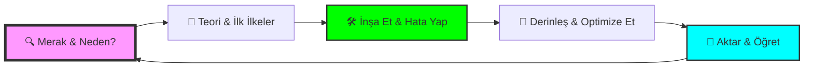

# Dev-Cephaneliği 🛡️⚒️

  

  
  
  
  

---

## 📜 Zanaatkarın Manifestosu

> "Yazılım, sadece makineler için komutlar yazmak değildir; karmaşıklığı düzene, kaosu estetiğe dönüştürme sanatıdır."

**Dev-Cephaneliği**, bir teknoloji yığını değil; bir **zihin yapısıdır**. Burada listelenen her araç, bir zanaatkarın elindeki çekiç, keski veya fırça gibidir. Bir ustanın farkı, alet çantasına ne koyduğunu değil; o aletle hangi problemi nasıl çözdüğünü bilmesidir. 

Bu depo; merakını asla kaybetmeyen, "bu neden böyle?" diye sormaktan korkmayan ve kodun ötesindeki felsefeyi arayan tüm **dijital zanaatkarlar** için inşa edilmiştir.

---

## 🎨 Öğrenme Sanatı & Stratejisi

Bir teknoloji yığınını (stack) sadece ezberlemek sizi bir "operatör" yapar; ama işin mantığını kavramak sizi bir **"zanaatkar"** (artisan) yapar. 

### 🏗️ Masterclass Öğrenme Döngüsü

### 🧠 Stratejik Yaklaşımlar
*   **🧩 İlk İlkeler (First Principles):** Temele inin. Bir aracın "nasıl"ından önce, çözdüğü "problemi" anlayın.
*   **💡 Feynman Tekniği:** Basitleştirin. Bir konuyu 5 yaşındaki bir çocuğa anlatabiliyorsanız, onu gerçekten anlamışsınızdır.
*   **📐 T-Shaped Model:** Bir alanda okyanus kadar derin (Uzmanlık), diğerlerinde kıyı kadar geniş (Kültür) olun.

---

## 🗺️ Teknoloji Ekosistemi

### 🏗️ 1. [Temel Programlama Dilleri & Mantık](./01-Temel-Programlama-Dilleri-Mantik)
*Mantığın ruhu ve düşüncenin alfabesi.*

### 🧠 2. [Yapay Zeka, Veri & Zeka](./02-Yapay-Zeka-Veri-Zeka)
*Verinin kehaneti ve makinelerin rüyası.*

### 🛡️ 3. [Altyapı, Bulut & DevOps](./03-Altyapi-Bulut-DevOps)
*Sistemlerin orkestrasyonu ve görünmez mimari.*

### 🌐 4. [Web, Mobil & Çalışma Ortamları](./04-Web-Mobil-Calisma-Ortamlari)
*Dijital dünyanın kapısı ve kullanıcı deneyimi.*

### 📟 5. [Gömülü Sistemler, IoT & İşletim Sistemleri](./05-Gomulu-Sistemler-IoT-OS)
*Donanım ile yazılımın fiziksel dansı.*

### 🧰 6. [Araçlar & Tasarım Seti](./06-Araclar-Tasarim-Seti)
*Ustanın atölyesi ve verimlilik araçları.*

### 🗄️ 7. [Veritabanları & Depolama](./07-Veritabanlari-Depolama)
*Sonsuz hafıza ve verinin düzeni.*

### ♾️ 8. [Meta & Verimlilik](./08-Meta-Verimlilik)
*Küresel bağlantı ve kolektif zeka.*

---

## 🤝 Katkıda Bulunma
Bu guild'e (loncaya) katılmak ve cephaneliği genişletmek için:

  <a href="CONTRIBUTING.md">Katkı Rehberi</a> • 
  <a href="CODE_OF_CONDUCT.md">Davranış Kuralları</a>

---

  Geliştirenler için, geliştirenler tarafından... ❤️

