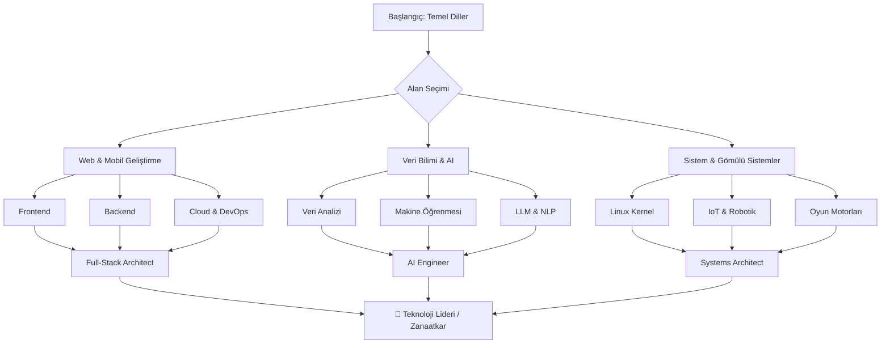

# Dev-Cephaneliği 🛡️⚒️

  

  
  
  
  

---

## 🎯 Vizyon
**Dev-Cephaneliği**, modern teknoloji dünyasında bir sistemin temelinden bulut mimarisine, gömülü sistemlerden yapay zekaya kadar uzanan devasa bir **teknoloji haritasıdır**. Burası bir eğitim seti değil; ihtiyacınız olduğunda elinizi atabileceğiniz, uca uca sistemler kurarken size rehberlik edecek bir **dijital zanaatkar cephaneliği**'dir.

> [!TIP]
> Bu listeyi bir okuma kitabı olarak değil, projelerinizde doğru silahı (teknolojiyi) seçmek için bir **seyir defteri** olarak kullanın.

---

## 🗺️ Teknoloji Ekosistemi

### 🏗️ Temel Programlama & Paradigmalar

### 🧠 Yapay Zeka, Veri & Analitik

### ☁️ Altyapı, Bulut & DevOps

### 🌐 Web, Mobil & Frameworkler

### 🤖 Sistemler, IoT & Oyun Motorları

### 🛠️ Geliştirici Araçları & Tasarım

### 🗄️ Veritabanları & Veri Depolama

---

## 📈 Gelişim Yol Haritası (Roadmap)

---

## 📂 Dizin Yapısı

| Dizin | Açıklama |
| :--- | :--- |
| [01-Temel-Diller](./01-Temel-Programlama-Dilleri-Paradigmalar) | Sistem, Nesne Yönelimli ve Fonksiyonel diller. |
| [02-AI-Veri](./02-Yapay-Zeka-Veri-Analitik) | ML, DL, LLM ve Veri analizi araçları. |
| [03-DevOps](./03-Altyapi-Bulut-DevOps) | Bulut, IaC ve CI/CD süreçleri. |
| [04-Web-Mobil](./04-Web-Mobil-Calisma-Ortamlari) | Modern frameworkler ve runtime ortamları. |
| [05-Gömülü-Sistemler](./05-Gomulu-Sistemler-IoT-Isletim-Sistemleri) | OS, IoT ve Oyun motorları. |
| [06-Araçlar-Tasarım](./06-Gelistirici-Araclari-Tasarim-Seti) | IDE'ler, Terminal ve Tasarım setleri. |
| [07-Veritabanları](./07-Veritabanlari-Veri-Depolama) | RDBMS, NoSQL ve Vektör veritabanları. |
| [08-Siber-Güvenlik](./08-Siber-Guvenlik-Ag) | Ağ analizi ve sızma testi araçları. |
| [09-Meta-Verimlilik](./09-Meta-Iletisim-Verimlilik) | Proje yönetimi ve iletişim araçları. |

---

## 🚀 Nasıl Kullanılır?

1. **İhtiyaca Göre Odaklan:** Bir proje geliştirirken hangi kategoriye ihtiyacın varsa oraya derinleş.
2. **T-Shaped Model:** Bir alanda uzmanlaşırken diğer alanlarda genel kültür sahibi ol.
3. **Kendi Stack'ini Belirle:** Bu cephanelikten en iyi araçları seç ve kendi imzanı at.

---

## 🤝 Katkıda Bulunma

Bu liste yaşayan bir dökümandır. Yeni nesil bir araç veya dil keşfettiyseniz, lütfen bir **Pull Request (PR)** açın!

  <a href="CONTRIBUTING.md">Katkı Rehberi</a> • 
  <a href="CODE_OF_CONDUCT.md">Davranış Kuralları</a>

---

  Geliştirenler için, geliştirenler tarafından... ❤️

