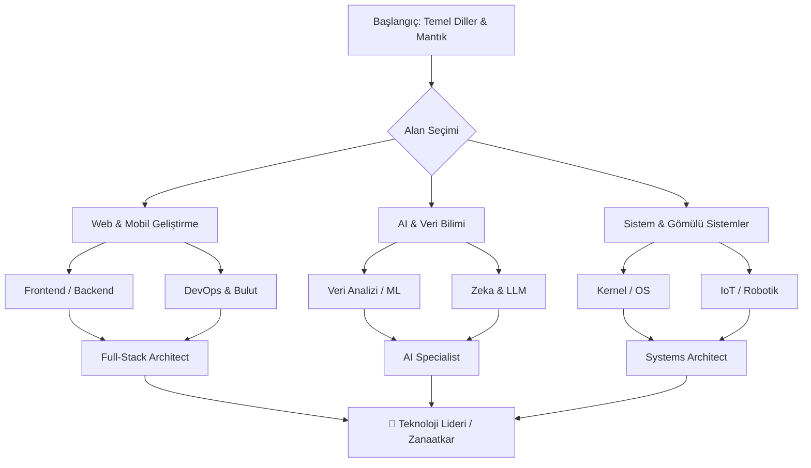

# Dev-Cephaneliği 🛡️⚒️

  

  
  
  
  

---

## 🎯 Vizyon
**Dev-Cephaneliği**, modern teknoloji dünyasında bir sistemin temelinden bulut mimarisine, gömülü sistemlerden yapay zekaya kadar uzanan devasa bir **teknoloji haritasıdır**. Burası bir eğitim seti değil; ihtiyacınız olduğunda elinizi atabileceğiniz, uca uca sistemler kurarken size rehberlik edecek bir **dijital zanaatkar cephaneliği**'dir.

> [!TIP]
> Bu listeyi bir okuma kitabı olarak değil, projelerinizde doğru silahı (teknolojiyi) seçmek için bir **seyir defteri** olarak kullanın.

---

## 🗺️ Teknoloji Ekosistemi

### 🏗️ 1. Temel Programlama Dilleri & Mantık

### 🧠 2. Yapay Zeka, Veri & Zeka

### 🛡️ 3. Altyapı, Bulut & DevOps

### 🌐 4. Web, Mobil & Çalışma Ortamları

### 📟 5. Gömülü Sistemler, IoT & İşletim Sistemleri

### 🧰 6. Araçlar & Tasarım Seti

### 🗄️ 7. Veritabanları & Depolama

### ♾️ 8. Meta & Verimlilik

---

## 📈 Gelişim Yol Haritası (Roadmap)

---

## 📂 Dizin Yapısı

| Dizin | Açıklama |
| :--- | :--- |
| [01-Temel-Diller-Mantık](./01-Temel-Programlama-Dilleri-Mantik) | Temel programlama dilleri ve mantıksal yapılar. |
| [02-AI-Veri-Zeka](./02-Yapay-Zeka-Veri-Zeka) | Yapay zeka, veri bilimi ve analitik araçlar. |
| [03-Altyapı-Bulut-DevOps](./03-Altyapi-Bulut-DevOps) | Bulut sistemleri, orkestrasyon ve DevOps. |
| [04-Web-Mobil](./04-Web-Mobil-Calisma-Ortamlari) | Web, mobil ve modern çalışma frameworkleri. |
| [05-Gömülü-IoT-OS](./05-Gomulu-Sistemler-IoT-OS) | İşletim sistemleri, IoT ve oyun motorları. |
| [06-Araçlar-Tasarım](./06-Araclar-Tasarim-Seti) | IDE'ler, tasarım araçları ve verimlilik setleri. |
| [07-Veritabanları-Depolama](./07-Veritabanlari-Depolama) | İlişkisel, NoSQL ve modern depolama çözümleri. |
| [08-Meta-Verimlilik](./08-Meta-Verimlilik) | İletişim, sosyal ağlar ve meta verimlilik araçları. |

---

## 🤝 Katkıda Bulunma

Bu liste yaşayan bir dökümandır. Yeni nesil bir araç veya dil keşfettiyseniz, lütfen bir **Pull Request (PR)** açın!

  <a href="CONTRIBUTING.md">Katkı Rehberi</a> • 
  <a href="CODE_OF_CONDUCT.md">Davranış Kuralları</a>

---

  Geliştirenler için, geliştirenler tarafından... ❤️

