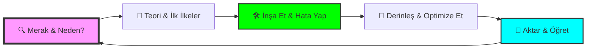

# Dev-Cephaneliği 🛡️⚒️

  

  
  
  
  

---

## 📜 Zanaatkarın Manifestosu

> "Yazılım, sadece makineler için komutlar yazmak değildir; karmaşıklığı düzene, kaosu estetiğe dönüştürme sanatıdır."

**Dev-Cephaneliği**, bir teknoloji yığını değil; bir **zihin yapısıdır**. Burada listelenen her araç, bir zanaatkarın elindeki çekiç, keski veya fırça gibidir. Bir ustanın farkı, alet çantasına ne koyduğunu değil; o aletle hangi problemi nasıl çözdüğünü bilmesidir. 

---

## 🎨 Öğrenme Sanatı & Stratejisi

### 🏗️ Masterclass Öğrenme Döngüsü

### 🧠 Stratejik Yaklaşımlar
*   **🧩 İlk İlkeler (First Principles):** Temele inin. Bir aracın "nasıl"ından önce, çözdüğü "problemi" anlayın.
*   **💡 Feynman Tekniği:** Basitleştirin. Bir konuyu 5 yaşındaki bir çocuğa anlatabiliyorsanız, onu gerçekten anlamışsınızdır.
*   **📐 T-Shaped Model:** Bir alanda okyanus kadar derin (Uzmanlık), diğerlerinde kıyı kadar geniş (Kültür) olun.

---

## 🏛️ Zanaatkarlığın Sütunları (The Pillars)

Teknolojiler değişir ama **prensipler bakidir**. Bu cephanelikteki araçları kullanırken şu sütunlara yaslanın:

1.  **SOLID & Temiz Kod:** Kodunuzun bir şiir gibi okunmasını sağlayın. Sadece çalışan kod değil, başkalarının (ve 6 ay sonraki kendinizin) anlayabileceği kod üretin.
2.  **DRY (Don't Repeat Yourself):** Tekrar, hatanın anasıdır. Mantığı tek bir yerde tutun, sistemin her yerine yaymayın.
3.  **KISS (Keep It Simple, Stupid):** Karmaşıklık bir marifet değildir. En iyi çözüm, en basit olandır.
4.  **YAGNI (You Ain't Gonna Need It):** İhtiyacınız olmayan özellikleri "belki lazım olur" diye eklemeyin. Kodun her satırı bir maliyettir.
5.  **Boy Scout Rule:** Baktığınız kodu bulduğunuzdan daha temiz bırakın.

---

## 🚀 Evrimsel Yol Haritası (Evolutionary Roadmap)

Bir zanaatkarın yolculuğu doğrusal değildir, ancak şu aşamalar size rehberlik edebilir:

### 🐣 Aşama 1: Temellerin İnşası (The Apprentice)
*   **Odak:** Programlama Mantığı, Algoritmalar, Terminal kullanımı.
*   **Hedef:** Bir dili (Python/C++) akıcı konuşmak ve "problem çözme" yeteneği kazanmak.
*   **Cephanelik Bölümü:** [1. Temel Diller & Mantık](./01-Temel-Programlama-Dilleri-Mantik)

### 🏗️ Aşama 2: Mimari & Veri (The Journeyman)
*   **Odak:** Web/Mobil Frameworkler, Veritabanları, API Tasarımı.
*   **Hedef:** Uçtan uca çalışan, veri saklayan ve kullanıcıyla konuşan sistemler kurmak.
*   **Cephanelik Bölümü:** [4. Web & Mobil](./04-Web-Mobil-Calisma-Ortamlari), [7. Veritabanları](./07-Veritabanlari-Depolama)

### 🎼 Aşama 3: Orkestrasyon & Güvenlik (The Specialist)
*   **Odak:** DevOps, Cloud, Siber Güvenlik, Ölçeklenebilirlik.
*   **Hedef:** Binlerce kullanıcıya hizmet veren, asla çökmeyen ve güvenli sistemler yönetmek.
*   **Cephanelik Bölümü:** [3. Altyapı & DevOps](./03-Altyapi-Bulut-DevOps), [5. Gömülü Sistemler & OS](./05-Gomulu-Sistemler-IoT-OS)

### 👁️‍🗨️ Aşama 4: Vizyon & Gelecek (The Master)
*   **Odak:** Yapay Zeka, Büyük Veri, Meta-Verimlilik.
*   **Hedef:** Teknolojiyi sadece kullanmak değil, geleceği inşa etmek ve topluluğa liderlik etmek.
*   **Cephanelik Bölümü:** [2. AI & Veri](./02-Yapay-Zeka-Veri-Zeka), [8. Meta & Verimlilik](./08-Meta-Verimlilik)

---

## 🗺️ Teknoloji Ekosistemi

| Bölüm | Başlık | Fokus |
| :--- | :--- | :--- |
| [🏗️ 1](./01-Temel-Programlama-Dilleri-Mantik) | **Temel Diller & Mantık** | Mantığın ruhu ve düşüncenin alfabesi. |
| [🧠 2](./02-Yapay-Zeka-Veri-Zeka) | **Yapay Zeka & Veri** | Verinin kehaneti ve makinelerin rüyası. |
| [🛡️ 3](./03-Altyapi-Bulut-DevOps) | **Altyapı & DevOps** | Sistemlerin orkestrasyonu ve görünmez mimari. |
| [🌐 4](./04-Web-Mobil-Calisma-Ortamlari) | **Web & Mobil** | Dijital dünyanın kapısı ve kullanıcı deneyimi. |
| [📟 5](./05-Gomulu-Sistemler-IoT-OS) | **Gömülü & OS** | Donanım ile yazılımın fiziksel dansı. |
| [🧰 6](./06-Araclar-Tasarim-Seti) | **Araçlar & Tasarım** | Ustanın atölyesi ve verimlilik araçları. |
| [🗄️ 7](./07-Veritabanlari-Depolama) | **Veritabanları** | Sonsuz hafıza ve verinin düzeni. |
| [♾️ 8](./08-Meta-Verimlilik) | **Meta & Verimlilik** | Küresel bağlantı ve kolektif zeka. |

---

## 🧙 Bilgece Tavsiyeler (Sage's Advice)

*   **Tuzak: "Sonsuz Öğrenme Döngüsü":** Sürekli tutorial izleyip hiçbir şey üretmemek en büyük düşmandır. Bir şey öğrenin ve hemen bozun, sonra tekrar yapın.
*   **Yavaş Öğrenin, Hızlı İnşa Edin:** Temel kavramları (Memory management, Networking) yavaş ve derin öğrenin. Framework'leri ise hızlıca projeler üzerinde kavrayın.
*   **İnsan İçin Yazın:** Kodunuzu bilgisayarlar anlar ama dökümantasyonunuzu ve temiz kodunuzu insanlar okur. İnsan iletişimini asla küçümsemeyin.
*   **Zihin Sağlığı:** Bir zanaatkarın en değerli aleti zihnidir. Molaları, uykuyu ve ergonomiyi projenin bir parçası olarak görün.

---

## 📂 Katkıda Bulunma
Bu guild'e (loncaya) katılmak ve cephaneliği genişletmek için:

  <a href="CONTRIBUTING.md">Katkı Rehberi</a> • 
  <a href="CODE_OF_CONDUCT.md">Davranış Kuralları</a>

---

  Geliştirenler için, geliştirenler tarafından... ❤️

