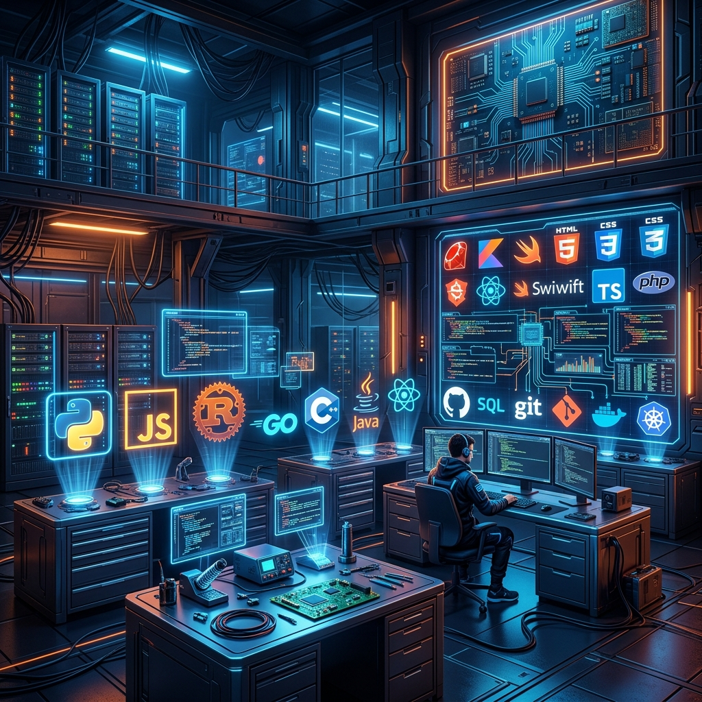
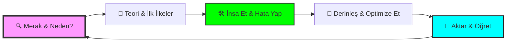
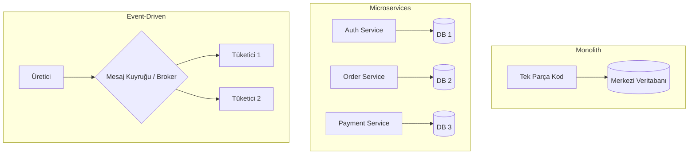

# Dev-Cephaneliği 🛡️⚒️

  

  
  
  
  

---

## 📜 Zanaatkarın Manifestosu

> "Yazılım, sadece makineler için komutlar yazmak değildir; karmaşıklığı düzene, kaosu estetiğe dönüştürme sanatıdır."

**Dev-Cephaneliği**, bir teknoloji yığını değil; bir **zihin yapısıdır**. Burada listelenen her araç, bir zanaatkarın elindeki çekiç, keski veya fırça gibidir. Bir ustanın farkı, alet çantasına ne koyduğunu değil; o aletle hangi problemi nasıl çözdüğünü bilmesidir. 

---

## 🎨 Öğrenme Sanatı & Stratejisi

### 🏗️ Masterclass Öğrenme Döngüsü

### 🧠 Stratejik Yaklaşımlar
*   **🧩 İlk İlkeler (First Principles):** Temele inin. Bir aracın "nasıl"ından önce, çözdüğü "problemi" anlayın.
*   **💡 Feynman Tekniği:** Basitleştirin. Bir konuyu 5 yaşındaki bir çocuğa anlatabiliyorsanız, onu gerçekten anlamışsınızdır.
*   **📐 T-Shaped Model:** Bir alanda okyanus kadar derin (Uzmanlık), diğerlerinde kıyı kadar geniş (Kültür) olun.

---

## 🏛️ Zanaatkarlığın Sütunları (The Pillars)

Teknolojiler değişir ama **prensipler bakidir**. Bu cephanelikteki araçları kullanırken şu sütunlara yaslanın:

1.  **SOLID & Temiz Kod:** Kodunuzun bir şiir gibi okunmasını sağlayın.
2.  **DRY (Don't Repeat Yourself):** Tekrar, hatanın anasıdır.
3.  **KISS (Keep It Simple, Stupid):** En iyi çözüm, en basit olandır.
4.  **YAGNI (You Ain't Gonna Need It):** İhtiyacınız olmayan özellikleri eklemeyin.
5.  **Boy Scout Rule:** Baktığınız kodu bulduğunuzdan daha temiz bırakın.

---

## 🚀 Evrimsel Yol Haritası (Evolutionary Roadmap)

### 🐣 Aşama 1: Temellerin İnşası (The Apprentice)
*   **Odak:** Programlama Mantığı, Algoritmalar, Terminal kullanımı.
*   **Cephanelik Bölümü:** [1. Temel Diller & Mantık](./01-Temel-Programlama-Dilleri-Mantik)

### 🏗️ Aşama 2: Mimari & Veri (The Journeyman)
*   **Odak:** Web/Mobil Frameworkler, Veritabanları, API Tasarımı.
*   **Cephanelik Bölümü:** [4. Web & Mobil](./04-Web-Mobil-Calisma-Ortamlari), [7. Veritabanları](./07-Veritabanlari-Depolama)

### 🎼 Aşama 3: Orkestrasyon & Güvenlik (The Specialist)
*   **Odak:** DevOps, Cloud, Ölçeklenebilirlik.
*   **Cephanelik Bölümü:** [3. Altyapı & DevOps](./03-Altyapi-Bulut-DevOps), [5. Gömülü Sistemler & OS](./05-Gomulu-Sistemler-IoT-OS)

### 👁️‍🗨️ Aşama 4: Vizyon & Gelecek (The Master)
*   **Odak:** Yapay Zeka, Büyük Veri, Meta-Verimlilik.
*   **Cephanelik Bölümü:** [2. AI & Veri](./02-Yapay-Zeka-Veri-Zeka), [8. Meta & Verimlilik](./08-Meta-Verimlilik)

---

## 📖 Zanaatkar Sözlüğü (The Artisan's Glossary)

| Terim | Tanım | Neden Önemli? |
| :--- | :--- | :--- |
| **Latency** | Bir isteğin yanıt süresi. | Kullanıcı deneyimini belirler. |
| **Throughput** | Birim zamandaki iş miktarı. | Ölçeklenebilirliği gösterir. |
| **Idempotency** | Tekrar eden işlemlerin sonucunun değişmemesi. | Sistem tutarlılığını korur. |
| **Scalability** | Yük karşısında kapasite artırma yeteneği. | Büyümeyi yönetmeyi sağlar. |
| **ACID / BASE** | Tutarlılık ve kullanılabilirlik modelleri. | Veri güvenliğini belirler. |
| **Abstraction** | Karmaşıklığı gizleme sanatı. | Yönetilebilir kodun anahtarıdır. |

---

## 🏛️ Mimari Yaklaşımlar (Architectural Patterns)

---

## 🗺️ Teknoloji Ekosistemi

| 🏗️ [Core Languages & Logic](./01-Temel-Programlama-Dilleri-Mantik) | 🧠 [AI, Data & Intelligence](./02-Yapay-Zeka-Veri-Zeka) | 🛡️ [Infra, Cloud & DevOps](./03-Altyapi-Bulut-DevOps) |
|:---:|:---:|:---:|
|    |    |    |

 

| 🌐 [Web, Mobile & Runtimes](./04-Web-Mobil-Calisma-Ortamlari) | 📟 [Embedded, IoT & OS](./05-Gomulu-Sistemler-IoT-OS) | 🧰 [Tools & Design Suite](./06-Araclar-Tasarim-Seti) |
|:---:|:---:|:---:|
|    |    |    |

 

| 🗄️ [Databases & Storage](./07-Veritabanlari-Depolama) | ♾️ [Meta & Productivity](./08-Meta-Verimlilik) |
|:---:|:---:|
|    |    |

---

## 🛤️ Kariyer Yolları (The Artisan's Paths)

### 🌐 1. Modern Web Mimarı (Full-Stack Architect)
*   **Adımlar:** 01 (JS/TS) → 04 (Next.js/Node) → 07 (Postgres/Redis) → 03 (Vercel/Docker)

### 🧠 2. Yapay Zeka Mühendisi (AI Engineer)
*   **Adımlar:** 01 (Python) → 02 (PyTorch/Transformers) → 07 (Vector DBs) → 03 (Cloud GPU)

### 🛡️ 3. Altyapı & Platform Mühendisi (DevOps/SRE)
*   **Adımlar:** 05 (Linux) → 03 (K8s/Terraform) → 06 (Bash/Automation) → 07 (Scalability)

---

## 🧙 Bilgece Tavsiyeler (Sage's Advice)

*   **Tuzak: "Sonsuz Öğrenme Döngüsü":** Sürekli tutorial izlemeyin, inşa edin.
*   **Yavaş Öğrenin, Hızlı İnşa Edin:** Temelleri derin öğrenin, framework'leri projeyle kavrayın.
*   **İnsan İçin Yazın:** Kodunuzu insanlar okur, temiz tutun.
*   **Zihin Sağlığı:** Ergonomi ve uykuyu projenin parçası görün.

---

## 📂 Katkıda Bulunma

  <a href="CONTRIBUTING.md">Katkı Rehberi</a> • 
  <a href="CODE_OF_CONDUCT.md">Davranış Kuralları</a>

---

  Geliştirenler için, geliştirenler tarafından... ❤️

